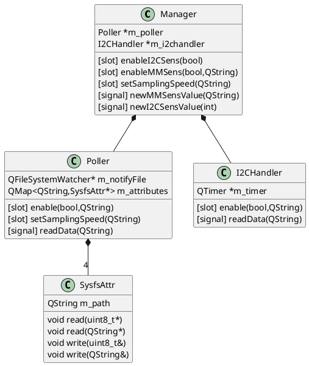
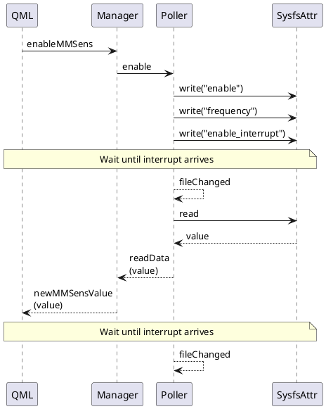
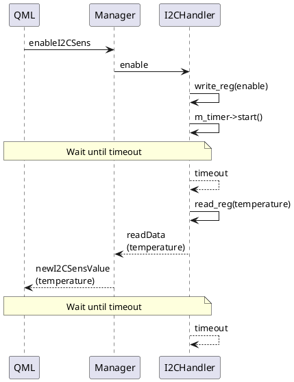

*This is part 5 of the QEMU Board Emulation post series.*

In the [previous post](https://straxy.github.io/2022/04/23/qemu-board-emulation-part-4-vexpress-yocto/) I showed how to use Yocto to build an image for Vexpress-A9 board. Yocto allows us to build a custom distribution and to streamline bootloader and kernel cross-compilation and handling.

In the [Linux device driver development post series](https://straxy.github.io/2022/05/19/linux-device-driver-development-qemu/) I showed custom memory-mapped and I2C devices for QEMU, and device driver and userspace application development for those devices. The userspace applications that were presented are usable from command line only, to demonstrate the desired functionality.

<br />

In real embedded systems, the use of non-GUI (command line only) applications is enough if the unit has no display. In that case data can be published to the outside world over some interface (usually network interface). We will cover this in some of the future posts.

However, there are a lot of cases where the embedded system has a display, and in that case the userspace application should provide graphical interface. There are different libraries that enable graphical interface to be shown, but in this post we will use Qt, version 6. We will integrate it into Yocto development using the [`meta-qt6`](https://code.qt.io/cgit/yocto/meta-qt6.git/) layer.

Items that will be covered in this post are

- [Qt6 application development](#qt6-application-development)
  - [Ideas](#ideas)
    - [Handling memory-mapped sensor](#handling-memory-mapped-sensor)
    - [Handling I2C sensor](#handling-i2c-sensor)
  - [QML interaction](#qml-interaction)
  - [Application design](#application-design)
- [Using `meta-qt6` Yocto layer](#using-meta-qt6-yocto-layer)
  - [Upgrading Yocto to kirkstone](#upgrading-yocto-to-kirkstone)
  - [Adding new layer](#adding-new-layer)
  - [Adding `qt6-sens-app` recipe](#adding-qt6-sens-app-recipe)
- [Testing](#testing)
  - [Building and running application](#building-and-running-application)
- [Summary](#summary)

Sources for the Yocto build environment for Vexpress-A9 can be found in following repositories:

* [https://github.com/straxy/qemu-vexpress-yocto](https://github.com/straxy/qemu-vexpress-yocto) - base repository used to initialize Yocto environment - `kirkstone` branch
* [https://github.com/straxy/meta-vexpress](https://github.com/straxy/meta-vexpress) - `meta-vexpress` layer containing distro, machine and images configuration, as well as recipes for bootloader and linux kernel - `kirkstone` branch

# Qt6 application development

The application is developed in Qt6, using combination of C++ and QML. Qt provides many classes which provide different functionality and simplify development.

One of the most interesting features are the signals and slots mechanism, where asynchronous communication between threads of execution is provided with loose coupling. One class can provide a *slot* function, essentially a callback, and another class can provide a *signal* function, and then *signal* and *slot* have to be *connected*. Once *signal* is emitted, the *slot* function is called.

We will go into more details soon, and the source code of the developed application can be found in the [`qt6-sens-app` github repository](https://github.com/straxy/qt6-sens-app).

## Ideas

The goal of this application is to provide graphical interface towards the custom memory-mapped and I2C QEMU devices developed in the [Linux device driver development post series](https://straxy.github.io/2022/05/19/linux-device-driver-development-qemu/).

The user interface should be simple, one part showing items related to the memory-mapped sensor and the other part showing items related to the I2C sensor, thus combining functionalities provided by [`mmsens-app`](https://github.com/straxy/mmsens-app) and [`i2csens-app`](https://github.com/straxy/i2csens-app).

I will try to reuse most of the functionalities from the existing classes, but updating them to use Qt-specific types (like `QString` instead of `std::string`). The biggest change for the existing implemented classes will be that they will inherit from `QObject` in order to be able to use the *signals* and *slots* functionality.

### Handling memory-mapped sensor

The `mmsens-app` has a separate thread where `poll` syscall is used to block thread execution until `sysfs_notify` is executed on the `interrupt` sysfs attribute.

In this case, Qt6 provides the `QFileSystemWatcher` class which provides similar functionality: the `QFileSystemWatcher` can be configured to track a state of a certain file until notify event is received, and then can emit the `fileChanged` signal, when read of `data` register can be performed.

This way we can just set up correct signals and slots and we don't need to create additional explicit thread.

As for the contol, we should be able to
* enable memory-mappped sensor and interrupt generation
* select sampling frequency
* present last read value

### Handling I2C sensor

The `i2csens-app` has a separate thread which blocks until timeout period expires, and then reads the `TEMPERATURE` register.

Using Qt we can use the `QTimer` class. In this case, when `QTimer` expires it emits the `timeout` signal, so we can use that to trigger read.

Again, we can only set up correct signals and slots and we don't need to create additional explicit thread.

As for the contol, we should be able to
* enable I2C sensor
* show last read I2C value

In this case, since the value is 'temperature', we will use line chart to show last 10 measured values.

## QML interaction

QML is used for frontend and C++ for backend implementation. They need to interact and exchange data, and there are [multiple ways](https://doc.qt.io/qt-6/qtqml-cppintegration-overview.html) to do it.

In this case I wanted to make a loose coupling between QML and C++, so I just used signals/slots mechanism for exchanging data between QML and C++.

> This is a simple application, so using only signals/slots was possible. In more complex situations some other mechanism presented in the link above may have to be used in order to provide full functionality.

Implemented GUI is shown in the following picture


## Application design

The class organization is presented in the following picture. `Manager` class represents glue between QML and C++ classes, routing signals in both directions.
`Poller` class implements functionality related to the memory-mapped sensor, while `I2CHandler` class implements functionality related to the I2C sensor.

<div hidden>

</div>


An example interaction for memory-mapped sensor and I2C sensor are shown in the following pictures.

<div hidden>

</div>


<div hidden>

</div>


# Using `meta-qt6` Yocto layer

In order to simplify cross-compilation we will use Yocto. The [`meta-qt6`](https://code.qt.io/cgit/yocto/meta-qt6.git/) layer provides all needed dependencies.

However, before the layer could be added to the `bblayers.conf` file, we need to update Yocto to `kirkstone` version to be compatible with the `meta-qt6` layer version `6.4`.

## Upgrading Yocto to kirkstone

Considering we have only few recipes in the [`meta-vexpress`](https://github.com/straxy/meta-vexpress) and [`meta-vexpress-apps`](https://github.com/straxy/meta-vexpress-apps) repositories, the upgrade process mostly consisted in updating the layer specification in `layer.conf` to add `kirkstone` as supported version, and in updating append/prepend/overrides to use `:` instead of `_` as separator (change that happened in `honister`).

## Adding new layer

After we have updated Yocto to `kirkstone`, we can add the layer just by updating `bblayers.conf` with the following line

```
${TOPDIR}/../sources/meta-qt6 \
```

## Adding `qt6-sens-app` recipe

The recipe for the [`qt6-sens-app`](https://github.com/straxy/qt6-sens-app) is similar to the ones used for other userspace applications.

Main difference are the Qt-related items

```bitbake
inherit qt6-cmake

DEPENDS += " qtbase qtdeclarative qtdeclarative-native "
RDEPENDS:${PN} += " qtcharts-qmlplugins ttf-dejavu-sans "
```

The `qtbase` and `qtdeclarative` provide base Qt C++ and QML support. Since we are using QtCharts (QML version) we also need to add `qtcharts-qmlplugins`.

> Base image does not have fonts installed, so I added `ttf-dejavu-sans` to be able to render text.

# Testing

## Building and running application

The Yocto image is built using the following command

```bash
# framebuffer image build command
$ DISTRO=mistra-framebuffer MACHINE=vexpress-qemu bitbake mistra-image
```

After image is built, copied to the SD card and QEMU is run, the following output will be visible

```bash
# QEMU output
$ qemu-system-arm -M vexpress-a9 -m 1G -kernel u-boot.elf \
                  -drive file=sd.img,format=raw,if=sd \
                  -net nic -net tap,ifname=qemu-tap0,script=no \
                  -serial mon:stdio
[ ... ]
Mistra FrameBuffer 4.0 vexpress-qemu /dev/ttyAMA0
vexpress-qemu login:
```

The application can be started using

```bash
$ qt6-sens-app
```

The application UI will be shown and we can interact with it.

Simple testing scenario that demonstrates application functionality is shown in the following image


# Summary

In this blog post the Yocto image is extended with Qt6 functionality. A new application for interaction with custom memory-mapped and I2C sensor is implemented and it's functionality demonstrated.
